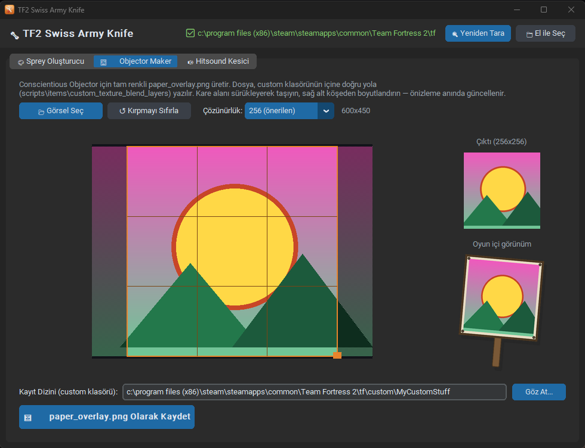

<p align="center">
  
</p>

<h1 align="center">TF2 Swiss Army Knife</h1>

<p align="center">
  Team Fortress 2 için hepsi bir arada masaüstü yardımcı aracı —
  <b>sprey oluşturucu</b>, tam renkli <b>Conscientious Objector</b> resmi yapıcı
  ve <b>hitsound / killsound</b> kesici. Oyun içi önizlemelerle, tek modern arayüzde.
</p>

<p align="center">
  <i>Windows &nbsp;•&nbsp; Python + CustomTkinter &nbsp;•&nbsp; kurulum gerektirmeyen tek <code>.exe</code></i>
</p>

<p align="center">
  
</p>

---

## ✨ Özellikler

- 🎨 **Sprey Oluşturucu** — resim/GIF'i `.vtf` + `.vmt` spreye çevirir, 512 KB
  sınırına göre otomatik optimize eder, gerçek DXT sıkıştırmasıyla "oyun içi"
  önizleme gösterir.
- 🖼️ **Objector Maker** — Conscientious Objector için tam renkli
  `paper_overlay.png` üretir, canlı kırpma önizlemesi ve tabela maketi ile.
- 🔊 **Hitsound Kesici** — sesi dalga formu üzerinden kırpar, TF2 standardı
  (44100 Hz, 16-bit) `hitsound.wav` / `killsound.wav` olarak kaydeder.
- 📁 **Otomatik TF2 tespiti** — `tf` klasörünü kayıt defteri ve Steam
  kütüphanelerinden bulur; her modülün kendi kayıt yolu ayarı vardır ve kalıcı
  olarak saklanır.

---

## 🚀 Kurulum

### Seçenek A — Hazır .exe (önerilen, Python gerekmez)

1. Sağdaki **[Releases](../../releases)** bölümüne git.
2. En son sürümden **`TF2 Swiss Army Knife.exe`** dosyasını indir.
3. Çift tıkla — çalıştırmak için başka bir şey yüklemene gerek yok.

> **Windows SmartScreen uyarısı:** İmzasız bir uygulama olduğu için Windows
> "Bilinmeyen yayımcı" diyebilir. **Ek bilgi → Yine de çalıştır** ile açabilirsin.
> İlk açılış birkaç saniye sürebilir (tek dosya exe kendini geçici klasöre açar).

### Seçenek B — Kaynaktan çalıştır (geliştiriciler için)

Gereksinim: **Python 3.10+** (Windows).

```bash
git clone https://github.com/<KULLANICI_ADIN>/TF2-Swiss-Army-Knife.git
cd TF2-Swiss-Army-Knife
pip install -r requirements.txt
python main.py
```

---

## 📖 Kullanım

Uygulama açıldığında üstte TF2 klasörünü otomatik bulur. Bulamazsa **📁 El ile
Seç** ile `...\Team Fortress 2\tf` klasörünü gösterebilirsin. Her sekmenin altında
**Kayıt Dizini** + **Göz At** vardır; ayarların `config.json`'a kaydedilir.

### 🎨 Sprey Oluşturucu

1. **Görsel Seç** (`.png / .jpg / .gif`) — GIF'ler animasyonlu desteklenir.
2. Sprey adını ve maks. çözünürlüğü (512/256/128) belirle.
3. **Oyun İçi (VTF)** sekmesine geçerek spreyin oyunda gerçekte nasıl görüneceğini
   (DXT sıkıştırma dahil) gör.
4. **Kayıt Dizini** olarak `...\tf\materials\vgui\logos` seç ve **Sprey Oluştur**.
5. Oyunda: **Ayarlar → Multiplayer → Sprey** listesinden seç.

Boyut 512 KB'ı aşarsa çözünürlük ve (GIF'lerde) kare sayısı otomatik düşürülür.

### 🖼️ Objector Maker (Full-Color Conscientious Objector)

1. **Görsel Seç**, kare kırpma alanını sürükleyip boyutlandır — çıktı ve tabela
   önizlemesi anında güncellenir.
2. **Çözünürlük**: `256 (önerilen)` / `128 (en uyumlu)` / `512 (en keskin)`.
3. **Kayıt Dizini** olarak custom klasörünü seç (örn. `...\tf\custom\BenimModum`).
   Dosya otomatik olarak doğru yola yazılır:
   `scripts\items\custom_texture_blend_layers\paper_overlay.png`
4. **TF2'yi tamamen kapat**, dosyayı oluştur, oyunu aç ve **Decal Tool** ile
   Conscientious Objector'a `paper_overlay`'i uygula.

> ⚠️ Bu, Source motorunun asenkron doku yüklemesini kullanan bir yöntemdir ve
> bazen hemen görünmez. Görünmezse çözünürlüğü **128**'e al, GPU sürücülerini
> güncelle, launch seçeneklerine sabit bir `-dxlevel` ekle ve TF2'yi yeniden başlat.
> Not: `materials\...` yolu **çalışmaz** — dosya `scripts\items\...` altında olmalı.

### 🔊 Hitsound Kesici

1. **Ses Dosyası Seç** (`.mp3 / .wav / .ogg / .flac`).
2. Dalga formundaki turuncu tutamaçlarla başlangıç/bitişi seç, **▶ Önizle** ile dinle.
3. **Kayıt Dizini** olarak custom klasörünü seç.
4. **🎯 Hitsound** veya **💀 Killsound Olarak Aktar** — sırasıyla
   `sound\ui\hitsound.wav` / `sound\ui\killsound.wav` olarak kaydedilir.

> Hitsound'un çalışması için oyunda **Options → Advanced → "Play a hit sound"**
> açık olmalı.

---

## 🛠️ Kaynaktan .exe Derleme

```bash
pip install -r requirements.txt pyinstaller
python assets/make_icon.py
```

Ardından `build.bat` dosyasını çalıştır **veya** şu komutu ver:

```bash
pyinstaller --noconfirm --clean --onefile --windowed ^
  --name "TF2 Swiss Army Knife" --icon "assets\icon.ico" ^
  --add-data "assets\icon.ico;assets" ^
  --collect-all customtkinter --collect-all soundfile --collect-all sounddevice ^
  --exclude-module scipy main.py
```

Çıktı: `dist\TF2 Swiss Army Knife.exe` (~31 MB). Notlar:
- `scipy` bilerek hariç tutulur (~100 MB tasarruf); ses yeniden örnekleme
  `core/audio.py` içindeki saf-numpy pencereli-sinc filtresiyle yapılır (≈85 dB SNR).
- Frozen (exe) modda `config.json`, `%APPDATA%\TF2SwissArmyKnife\` altında tutulur.

---

## 🧪 Testler

```bash
python tests/test_core.py       # çekirdek doğrulama (VTF ayrıştırıcı + DXT çözücü)
python tests/test_gui_smoke.py  # üç sekmeyi uçtan uca süren GUI duman testi
```

---

## 📂 Proje Yapısı

```
main.py            # giriş noktası
config.py          # config.json yönetimi (kaynak/exe farkı dahil)
tf2_locator.py     # TF2 otomatik tespit (registry + libraryfolders.vdf)
core/
  vtf.py           # VTF 7.1 yazıcı + numpy DXT1/DXT5 kodlayıcı/çözücü
  spray.py         # sprey üretim hattı (boyut/kare planlayıcı, VMT)
  objector.py      # paper_overlay üretimi
  preview.py       # oyun içi önizlemeler (DXT gidiş-dönüş, duvar, tabela)
  audio.py         # kırpma + yeniden örnekleme + WAV dışa aktarma
  paths.py         # yol tekrarlama önleyici yardımcı
gui/
  app.py           # ana pencere, sekmeler, TF2 durumu
  widgets.py       # PathSelector, CropCanvas, WaveformCanvas
  spray_tab.py / objector_tab.py / sound_tab.py
assets/make_icon.py# uygulama ikonunu üretir
tests/             # çekirdek + GUI testleri
```

---

## ❓ Sık Karşılaşılan Sorunlar

- **"TF2 bulunamadı"** → Üstteki **📁 El ile Seç** ile `...\Team Fortress 2\tf`
  klasörünü göster.
- **Sprey oyunda görünmüyor** → Çıktının `tf\materials\vgui\logos` içinde olduğundan
  ve oyunda seçili olduğundan emin ol.
- **Objector renkli çıkmıyor** → Dosya `scripts\items\custom_texture_blend_layers`
  altında olmalı; çözünürlüğü 128'e alıp tekrar dene, TF2'yi yeniden başlat.
- **MP3 açılmıyor** → Program libsndfile ile gelir; yine de sorun olursa dosyayı
  `.wav`'a çevirip dene.

---

## ⚠️ "Windows bilgisayarınızı korudu" uyarısı (SmartScreen)

Uygulamayı indirip ilk kez açtığında Windows **"Bilinmeyen yayımcı /
Windows protected your PC"** uyarısı gösterebilir. Açmak için:
**Ek bilgi (More info) → Yine de çalıştır (Run anyway)**.

**Bu bir virüs uyarısı değildir.** Bu uyarı, ücretli bir *kod imzalama
sertifikası* ile imzalanmamış ve henüz yeterince indirilmemiş **her** yeni
uygulamada çıkar — Windows yalnızca "bu yayımcıyı henüz tanımıyorum" diyor.

Neden güvenebilirsin:
- **Kaynak kodun tamamı açık** — inceleyebilir veya `build.bat` ile kendin
  derleyip aynı exe'yi üretebilirsin.
- Program yalnızca **senin seçtiğin klasörlere** dosya yazar; kurulum yapmaz,
  arka planda çalışmaz, internete veri göndermez.

### Uyarıyı tamamen kaldırmak
Kalıcı çözüm exe'yi bir **kod imzalama sertifikasıyla imzalamaktır**:
- **EV (Extended Validation) sertifikası** — SmartScreen'de *anında* güven,
  uyarı hiç çıkmaz. Ancak pahalıdır (yılda ~birkaç yüz $) ve kimlik/şirket
  doğrulaması + donanım anahtarı gerekir.
- **Azure Trusted Signing** — Microsoft'un ucuz (~aylık $10) imzalama servisi;
  Microsoft köküne zincirlendiği için güven daha hızlı oluşur.
- **SignPath (OSS planı)** — açık kaynak projelere ücretsiz kod imzalama.
- **Zamanla ücretsiz** — imzasız olsa bile, uygulama yeterince indirilip
  çalıştırıldıkça SmartScreen "itibar" kazanır ve uyarı kendiliğinden kaybolur.

### VirusTotal taraması & dosya doğrulama
Bu sürümün (**v1.1.0**) exe'sini 70+ antivirüs motoruyla kontrol edebilirsin:

- **VirusTotal raporu:**
  https://www.virustotal.com/gui/file/c7fda15fdfb08cd1472c8a4625ca26beb505f47db6f7d556cafb31a7a2fef686
- **SHA-256:**
  `c7fda15fdfb08cd1472c8a4625ca26beb505f47db6f7d556cafb31a7a2fef686`

İndirdiğin dosyanın gerçekten bu sürüm olduğunu (kimse değiştirmemiş) doğrulamak
için PowerShell'de:

```powershell
Get-FileHash "TF2 Swiss Army Knife.exe" -Algorithm SHA256
```

Çıkan değer yukarıdaki SHA-256 ile aynıysa dosya birebir orijinaldir.

> **Sonuç (v1.1.0): ~4/68 motor işaretliyor — hepsi PyInstaller yanlış alarmı.**
> İşaretleyenler Bkav, SecureAge, Gridinsoft, Yandex gibi küçük/sezgisel
> motorlar ve tehdit etiketi zaten `pyinstaller` / `Riskware.PyInstaller`
> diyor (gerçek bir zararlı değil). **Microsoft Defender, Kaspersky, BitDefender,
> ESET, Avast, AVG, Fortinet, Google, CrowdStrike, Malwarebytes dâhil tüm büyük
> motorlar TEMİZ.** İmzasız PyInstaller uygulamaları için bu normaldir ve
> zararsızdır. Endişen varsa kaynaktan kendin de derleyebilirsin (`build.bat`).

---

## 📜 Lisans

[MIT](LICENSE) — dilediğin gibi kullan, değiştir, dağıt.

## 🙌 Katkı

Bu araç TF2 topluluğunun bilinen sprey/decal/hitsound yöntemlerini tek yerde
toplar. Hata bildirimi ve öneriler için **Issues** kısmını kullanabilirsin.
